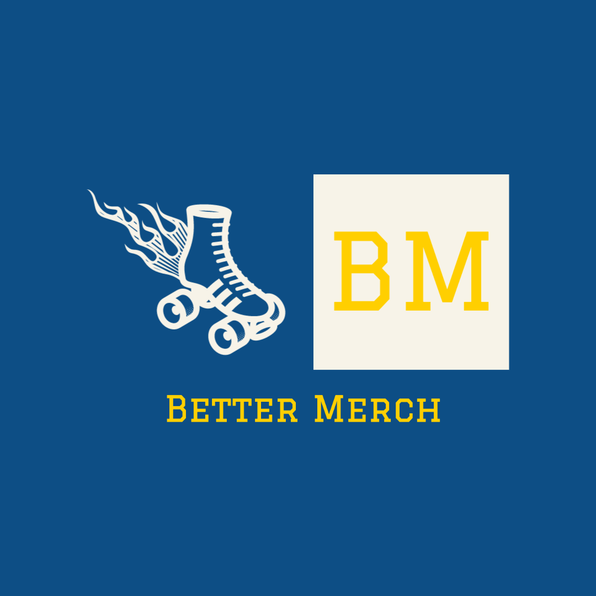

     
    
    

    

    

        <a href="https://github.com/lionturtle99">
            <strong>LionTurtle99</strong>
        </a>
    

    

        <a href="mailto:<liamthelastson@gmail.com>">
            
        </a>
        ¨
        
    
    

  <small>Initiated May, 2022</small>

<h1 align="center">Better Merch</h1>

Roller Skate e-commerce. Fully functional e-Commerce website for local artists to sell their more modern "better" roller skate merchandise than what's currently available on a single platform.

<!-- 
<a href="#">Visit live site</a>
 -->

## Motivation

Since I started rollerskating back in 2017 I have met so many wonderful skaters that say the same thing: "roller skating needs a rebranding". Roller skating merchandize became very popular in the 1970s when it was associated with disco music and roller discos. Since then roller skating culture has changed but the merchandiz estayed the same. This is my humble attempt to bring a new style to roller skating merechandise.

## Technologies Used

* _Visual Studio Code_
* _Google Chrome_
* _git_
* _HTML_
* _CSS_
* _Bootstrap_
* _JavaScript_
* _React_
* _Redux_
* _Firebase_
* _Stripe_
* _NodeJS_

## Known Issues
* No none issues

## Acknowledgements
- Thank you to my brother Lauden for encouraging me to pursue a career in tech and always believing in me. You're a great brother and a better friend.

### ⚖️ License

This project is licensed under the [MIT License](https://opensource.org/licenses/MIT). Copyright (C) 2022 Liam Eller. All Rights Reserved.

## 📋 Research & Planning Log

### Rollerskate E-Commerce Website Proposal

* _e-commerce website for local artists to sell their rollerskate art at a convenient single location_
* _Firebase for authenticationa and database_
* _React frontend_

##### MVP
* _Sleek and professional UI_
* _Users should be able to signup/in/out_
* _Search a database for items available for purchase_ 
* _Add items to a shopping cart and securely purchase those items_

#### Stretch Goals
* _3D landing page using ThreeJS_
* _Use authentication and authorization for artists to add items_
* _Use Printful API to add customizable t-shirt functionality_
* _Use Printful or another API to design your own skates and then render that image into a 3D model using something like https://www.homely.ai/_
* _Interact with that 3D model of your roller skates in a 3D environment_

### Attendance Log

_Brain storming with dev group_

_Watch videos on integrating ThreeJS with React using React Fiber_

_Additional research into React and ThreeJS_

_Arrange a meet up with a Epicodus alum with experience in React-ThreeJS/Fiber_

_Finish React-ThreeJS tutorial on youtube_

_watch tutorials on creating a .NET core backend and React front end. Start project using dotnet new react... command_

_Configuring project for use with newer packages_

_Considering using Firebase as backend_

_trouble shooting package management_

<a href="#">Return to Top</a>
